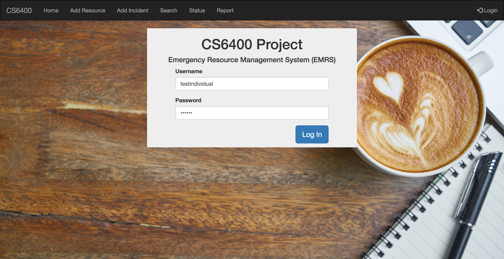
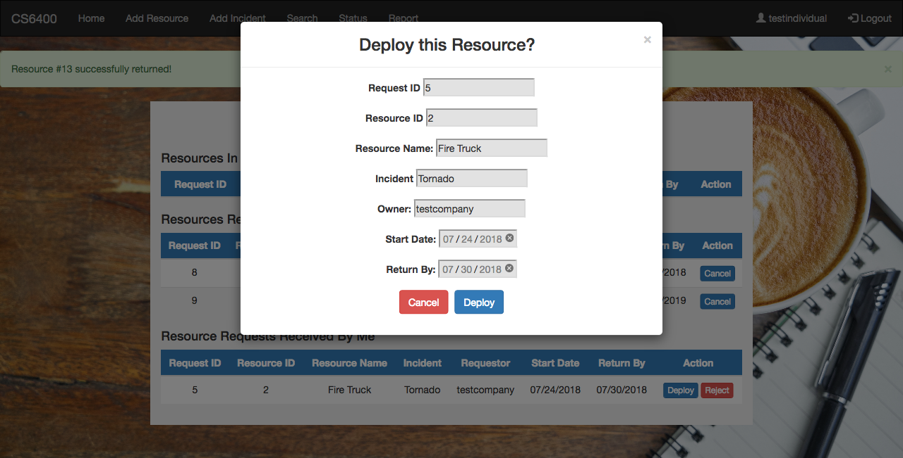

# Phase 3

## Instructions to Run:

### Setup Database Locally:
**Using Ubuntu or Mac:**  

1. Change to root (sudo) user
2. cd into the directory of this file (setup folder)
3. Set file permissions:  
        ```bash
        chmod a+rwx <setupUbuntu.sh or setupMac.sh>
        ```
4. Run setup shell:  
    * For Ubuntu:  
        ```bash
        yes | ./setupUbuntu.sh
        ```
    * For Mac:  
        ```bash
        yes | ./setupMac.sh
        ```
5. If permissions denied, input the root password in lines 25 to 28 --password= pw and uncomment. Comment out lines 21 to 24.

### Running App:
1. cd into directory with app.py
2. In terminal run:  
    ```bash
    python app.py
    ```
3. Connect to local host (e.g. http://127.0.0.1:5000/) with browser

## Pages

**Overview:**
1. **Add a Resource** Allows the user to add resources that will be available for use in case of a nearby emergency incident. Other users in the system will be able to search for and request these resources. 
2. **Add an Incident** The user selects this option in order to add some basic information about an emergency incident that has just occurred. 
3. **Search for Resources** This option allows the user to search for and request available resources in the case of an emergency. 
4. **Resource Status** This option allows the user to view currently deployed resources and manage resource requests that she has sent or received. 
5. **Resource Report** This option shows a summary report of all the user's resources grouped by their primary Emergency Support Function. 

---
## Login


## Main Menu


## Add Resource
### 1. Empty Form

### 2. Empty Form Submit with Required Fields

### 3. Filled Form

### 4. Submitted Form


## Add Incident
### 1. Empty Form

### 2. Empty Form Submit with Required Fields

### 3. Filled Form

### 4. Submitted Form


## Search Resources
### 1. Empty Form

### 2. Empty Form Search - Returns All Incidents

### 3a. Search Ford
#### Search Criteria - Keyword: Ford; ESF: Transportation; Location: 500; Incident: MD-3: Earthquake

### 3b. Search Ford - Results

### 4a. Search Incident: MD-2: Volcano
#### Search Criteria - ESF: Transportation; Location: 5000; Incident: MD-2: Volcano

### 4b. Search Ford - Results

### 4c. Search Ford - Requested FBI Police Car (Pending Request)


## Resource Status
### 1. Resource Status for Current User (testindividual)

### 2. Return Resource (Other User's Resource) - Peter's Other Fire Truck

### 3. Deploy Resource (Owned Resource) - Fire Truck 


## Resource Report
### Resource Report By Primary ESF

